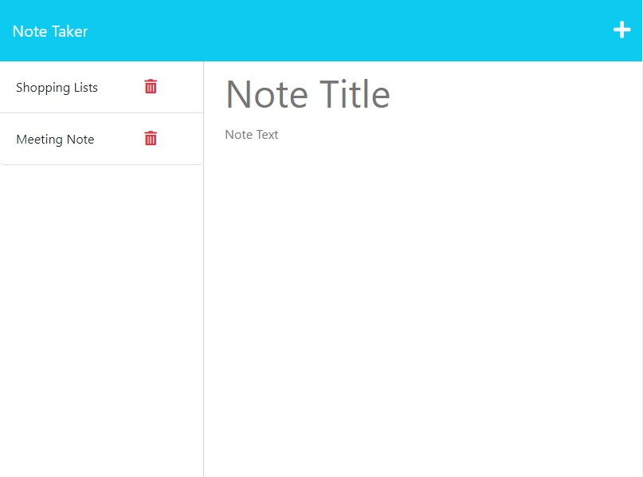

# Express Note Taker

## Description
The challenge of this week is to create a Note Taker application that allows a user to write and save note. This app will use an Express.js back end.

## Credit
- UNB Coding Bootcamp: Class Materials 
- Google Search Materials
- Forum and in-class discussion 
- Discussion of people on https://stackoverflow.com/
- https://www.w3schools.com

## License
MIT License

## Completed Works - Link and Screenshot

- https://gentle-gorge-64727.herokuapp.com/

- 